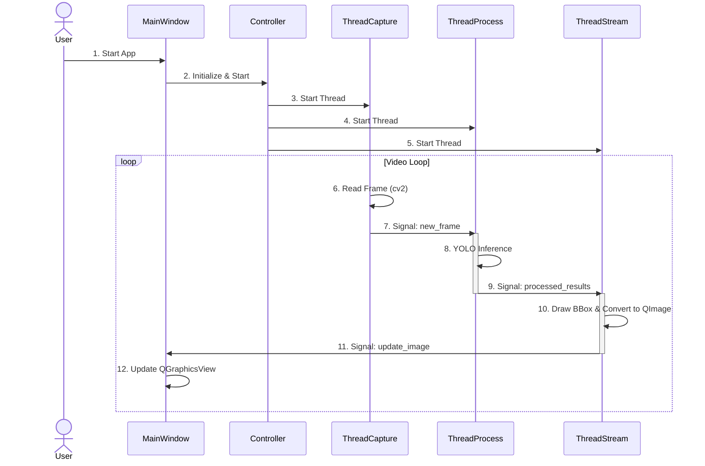
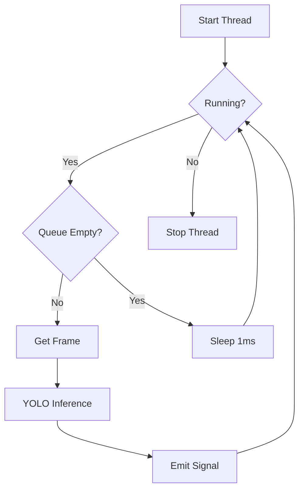

# DETAILED PROJECT ANALYSIS: YOLOv8 Multi-thread Detection

## 1. Thông Tin Cơ Bản (Basic Information)
- **Tên dự án (Project name)**: YOLOv8 Multi-thread Detection
- **Mục đích (Purpose)**: Hệ thống nhận diện đối tượng thời gian thực sử dụng YOLOv8 và PyQt5 với kiến trúc đa luồng hiệu năng cao, giải quyết vấn đề lag giao diện khi chạy model AI nặng.
- **Tech Stack**: Python 3.10+, PyQt5, YOLOv8 (Ultralytics), OpenCV, PyTorch.
- **Ngôn ngữ chính (Main language)**: Python 3.10+
- **Loại dự án (Project type)**: Computer Vision / AI Application

## 2. Vấn Đề Giải Quyết (Problems Solved)
Dự án giải quyết 3 vấn đề chính thường gặp trong các ứng dụng Computer Vision thời gian thực:
1.  **Lag giao diện (UI Blocking)**: Khi chạy model AI nặng trên main thread, giao diện sẽ bị treo (freeze) cho đến khi model xử lý xong frame, gây trải nghiệm người dùng rất tệ.
2.  **FPS thấp (Low FPS)**: Việc xử lý tuần tự (đọc ảnh -> xử lý -> hiển thị) làm tổng thời gian xử lý mỗi frame tăng lên, dẫn đến FPS thấp.
3.  **Không tận dụng hết tài nguyên**: CPU/GPU có thể bị idle trong lúc chờ I/O (đọc file/camera) nếu chạy đơn luồng.

## 3. Giải Pháp Đề Xuất (Proposed Solution)
Dự án áp dụng kiến trúc **Multi-threading** (Đa luồng) kết hợp với **Queue** (Hàng đợi):
1.  **Tách biệt luồng (Thread Separation)**: Chia ứng dụng thành 3 luồng worker độc lập:
    -   `Capture Thread`: Chuyên trách đọc frame từ video/camera.
    -   `Process Thread`: Chuyên trách chạy YOLOv8 inference.
    -   `Stream Thread`: Chuyên trách vẽ bounding box và chuẩn bị hình ảnh hiển thị.
2.  **Cơ chế Queue**: Sử dụng `queue.Queue` để đệm dữ liệu giữa các luồng, giúp các luồng hoạt động không đồng bộ mà không cần chờ nhau (non-blocking).
3.  **PyQt5 Signals**: Sử dụng cơ chế Signal/Slot của Qt để giao tiếp an toàn giữa các luồng và cập nhật UI trên Main Thread.

## 4. Kiến Trúc Tổng Thể (Overall Architecture)

### 4.1. Biểu Đồ Kiến Trúc Tổng Quan (Overall Architecture Diagram)

```mermaid
graph TB
    subgraph "User Interface Layer (Main Thread)"
        UI[MainWindow (PyQt5)]
        View[QGraphicsView]
    end
    
    subgraph "Business Logic Layer (Controller)"
        Controller[Controller]
    end
    
    subgraph "Data Processing Layer (Worker Threads)"
        Capture[ThreadCapture]
        Process[ThreadProcess]
        Stream[ThreadStream]
    end
    
    subgraph "External Resources"
        Video[Video Source/Camera]
        Model[YOLOv8 Model]
    end
    
    UI --> Controller
    Controller --> Capture
    Controller --> Process
    Controller --> Stream
    
    Video --> Capture
    Capture -->|Signal: new_frame| Process
    Process -->|Signal: processed_results| Stream
    Process --> Model
    Stream -->|Signal: update_image| UI
```

### 4.2. Các Thành Phần Chính (Main Components)

#### 4.2.1. User Interface Layer
- **Mô tả**: Giao diện người dùng chính, hiển thị video stream và thông tin FPS.
- **Công nghệ**: PyQt5 (`QWidget`, `QGraphicsView`, `QLabel`).
- **Chức năng chính**:
    -   Hiển thị video realtime sau khi xử lý.
    -   Hiển thị FPS thực tế.
    -   Điều khiển Start/Stop ứng dụng (thông qua đóng cửa sổ).

#### 4.2.2. Business Logic Layer
- **Mô tả**: Lớp điều phối trung tâm, quản lý vòng đời của các luồng.
- **Module chính**: `src/controller.py`
- **Chức năng**:
    -   Khởi tạo các luồng (Capture, Process, Stream).
    -   Kết nối các tín hiệu (Signals) giữa các luồng để tạo thành pipeline.
    -   Bắt đầu và dừng các luồng đồng bộ.

#### 4.2.3. Data Processing Layer
- **Mô tả**: Các luồng xử lý dữ liệu nền (Background Workers).
- **Thành phần**:
    -   `ThreadCapture`: Wrapper cho `cv2.VideoCapture`, đọc frame liên tục.
    -   `ThreadProcess`: Wrapper cho `ultralytics.YOLO`, chạy inference.
    -   `ThreadStream`: Xử lý hậu kỳ (vẽ box) và chuyển đổi format ảnh cho Qt.

## 5. Luồng Hoạt Động Tổng Thể (Overall Workflow)

### 5.1. Biểu Đồ Sequence Tổng Quan (Overall Sequence Diagram)



### 5.2. Mô Tả Chi Tiết Từng Bước

1.  **Initialization**:
    -   `main.py` khởi tạo `Controller` và `MainWindow`.
    -   `Controller` tạo 3 luồng: Capture, Process, Stream nhưng chưa chạy.
    -   `Controller` kết nối signal: `Capture.new_frame` -> `Process.add_frame`, `Process.processed_results` -> `Stream.display_frame`.

2.  **Capture Phase**:
    -   `ThreadCapture` đọc frame từ video file hoặc camera sử dụng OpenCV.
    -   Kiểm soát tốc độ đọc dựa trên `target_fps` cấu hình.
    -   Emit signal `new_frame` chứa numpy array của ảnh.

3.  **Processing Phase**:
    -   `ThreadProcess` nhận frame và đưa vào `queue` nội bộ (giới hạn size=5 để tránh lag nếu xử lý chậm).
    -   Lấy frame từ queue, chạy qua model YOLOv8 (`self.model(frame)`).
    -   Emit signal `processed_results` chứa: frame gốc, kết quả detection (boxes, classes), và FPS xử lý.

4.  **Streaming Phase**:
    -   `ThreadStream` nhận kết quả.
    -   Gọi `utils.draw_results` để vẽ bounding box lên frame.
    -   Chuyển đổi màu từ BGR (OpenCV) sang RGB.
    -   Tạo đối tượng `QImage` từ dữ liệu pixel.
    -   Emit signal `update_image` chứa `QImage`.

5.  **Display Phase**:
    -   `MainWindow` nhận signal `update_image`.
    -   Chuyển `QImage` thành `QPixmap` và hiển thị lên `QGraphicsView`.
    -   Cập nhật nhãn FPS.

## 6. Pipeline Xử Lý Dữ Liệu (Data Processing Pipeline)

### 6.1. Biểu Đồ Data Pipeline

```mermaid
graph LR
    subgraph "Input Stage"
        Raw[Video/Camera] --> Read[cv2.read()]
    end
    
    subgraph "Preprocessing Stage"
        Read --> Queue[Frame Queue]
        Queue --> Resize[YOLO Internal Resize]
    end
    
    subgraph "Inference Stage"
        Resize --> Model[YOLOv8 Model]
        Model --> NMS[Non-Max Suppression]
    end
    
    subgraph "Post-processing Stage"
        NMS --> Draw[Draw BBox]
        Draw --> Convert[BGR to RGB]
        Convert --> QImg[Create QImage]
    end
    
    subgraph "Output Stage"
        QImg --> Display[QGraphicsView]
    end
```

### 6.2. Chi Tiết Từng Giai Đoạn

#### 6.2.1. Input Stage
-   **Raw Input**: Video file (mp4, avi...) hoặc Camera stream (index 0).
-   **Validation**: Kiểm tra `cap.isOpened()` để đảm bảo nguồn video hợp lệ.

#### 6.2.2. Preprocessing & Inference Stage
-   **Queueing**: Sử dụng `queue.Queue(maxsize=5)` trong `ThreadProcess`. Nếu queue đầy, frame mới sẽ không được thêm vào (drop frame) để đảm bảo độ trễ thấp nhất (real-time strategy).
-   **YOLOv8**: Model tự động handle việc resize ảnh về kích thước input (thường là 640x640) và chuẩn hóa pixel (0-255 -> 0.0-1.0).

#### 6.2.3. Post-processing Stage
-   **Visualization**:
    -   Duyệt qua danh sách kết quả từ YOLO (`results[0].boxes`).
    -   Lọc theo `confidence_threshold` (cấu hình trong YAML).
    -   Vẽ hình chữ nhật (cv2.rectangle) và text (cv2.putText).
-   **Format Conversion**:
    -   OpenCV dùng BGR, Qt dùng RGB -> Cần `cv2.cvtColor(frame, cv2.COLOR_BGR2RGB)`.
    -   Tạo `QImage` cần đúng format `Format_RGB888` và `bytes_per_line` để tránh méo hình.

## 7. Phân Tích Các Module Chính (Main Module Analysis)

### 7.1. Module: `src/process_thread.py`

#### 7.1.1. Mục Đích
Luồng quan trọng nhất, chịu trách nhiệm chạy AI model. Tách biệt việc này giúp UI không bị đơ khi model tính toán nặng.

#### 7.1.2. Luồng Hoạt Động


#### 7.1.3. Các Class Chính
**Class `ThreadProcess(QThread)`**:
-   `__init__`: Load model YOLO, chuyển sang device (CPU/CUDA) dựa trên config.
-   `add_frame(frame)`: Slot nhận frame từ Capture thread. Đẩy vào queue. Có logic drop frame nếu queue đầy.
-   `run()`: Vòng lặp vô tận (while running). Lấy frame -> Model predict -> Emit signal. Tính toán FPS tức thời.

### 7.2. Module: `src/controller.py`

#### 7.2.1. Mục Đích
Đóng vai trò "nhạc trưởng", kết nối các thành phần rời rạc lại với nhau. Giúp code main gọn gàng và dễ bảo trì.

#### 7.2.2. Logic Chính
-   Sử dụng Pattern **Mediator** (đơn giản hóa): Các thread không gọi nhau trực tiếp mà thông qua Controller để kết nối signal.
-   `_connect_signals()`:
    ```python
    # Capture -> Process
    self.capture_thread.new_frame.connect(self.process_thread.add_frame)
    # Process -> Stream
    self.process_thread.processed_results.connect(self.stream_thread.display_frame)
    ```
    Điều này tạo ra luồng dữ liệu một chiều (Unidirectional Data Flow), dễ debug và kiểm soát.

### 7.3. Module: `src/capture_thread.py`

#### 7.3.1. Mục Đích
Đảm bảo việc đọc video ổn định và đúng FPS mong muốn, không phụ thuộc vào tốc độ xử lý của AI.

#### 7.3.2. Logic Chính
-   Sử dụng `time.sleep()` thông minh để duy trì `target_fps`.
-   Tính toán `sleep_time = (1.0 / target_fps) - elapsed_time`. Nếu xử lý đọc mất nhiều thời gian hơn chu kỳ FPS, sleep_time sẽ là 0 (đọc ngay lập tức).
