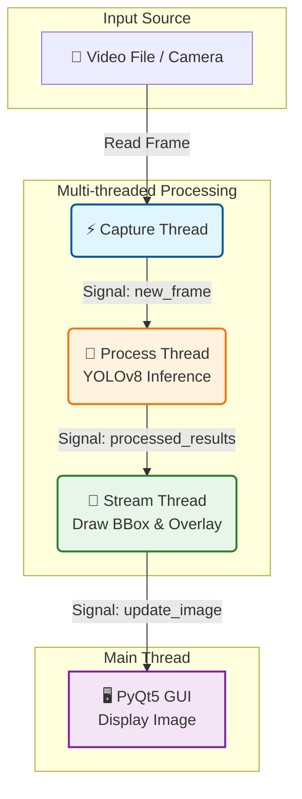

# YOLOv8 Multi-thread Detection

> **Hệ thống nhận diện đối tượng thời gian thực sử dụng YOLOv8 và PyQt5 với kiến trúc đa luồng hiệu năng cao.**

[](LICENSE)
[](https://www.python.org/)
[](https://github.com/ultralytics/ultralytics)

---

## 📚 Mục Lục

- [Giới Thiệu](#giới-thiệu)
- [Tính Năng](#tính-năng)
- [Yêu Cầu Hệ Thống](#yêu-cầu-hệ-thống)
- [Cài Đặt](#cài-đặt)
- [Sử Dụng](#sử-dụng)
- [Cấu Trúc Dự Án](#cấu-trúc-dự-án)
- [Configuration](#configuration)
- [License](#license)
- [Liên Hệ](#liên-hệ)

---

## 🎯 Giới Thiệu

### Vấn Đề
Trong các ứng dụng Computer Vision thời gian thực, việc chạy model AI nặng (như YOLO) trên cùng một luồng với giao diện (UI) và đọc video thường dẫn đến:
- ❌ **Lag giao diện**: UI bị treo khi model đang xử lý.
- ❌ **FPS thấp**: Tốc độ xử lý bị giới hạn bởi tác vụ chậm nhất.
- ❌ **Trải nghiệm kém**: Video không mượt mà, phản hồi chậm.

### Giải Pháp
Dự án này áp dụng kiến trúc **Multi-threading** (Đa luồng) để giải quyết triệt để các vấn đề trên:
- ✅ **Tách biệt tác vụ**: Chia nhỏ thành 3 luồng độc lập: Capture (Đọc ảnh), Process (Xử lý AI), và Stream (Hiển thị).
- ✅ **Tối ưu hiệu năng**: Tận dụng tối đa tài nguyên phần cứng (CPU/GPU).
- ✅ **Mượt mà**: Giao diện PyQt5 luôn phản hồi ngay lập tức, không bị block bởi AI.

### Công Nghệ
**YOLOv8 Multi-thread Detection** được xây dựng với:
- **Python 3.10+**: Ngôn ngữ lập trình chính.
- **YOLOv8 (Ultralytics)**: State-of-the-art Object Detection model.
- **PyQt5**: Framework giao diện mạnh mẽ và linh hoạt.
- **OpenCV**: Xử lý ảnh và video.
- **PyTorch**: Deep Learning framework hỗ trợ CUDA.

---

## ✨ Tính Năng

### Core Features
- 🎯 **Real-time Detection**: Nhận diện người (Person detection) với độ chính xác cao sử dụng YOLOv8.
- 🚀 **Multi-threaded Architecture**:
  - **Capture Thread**: Đọc frame từ video/camera tốc độ cao.
  - **Process Thread**: Chạy AI inference độc lập.
  - **Stream Thread**: Hiển thị kết quả lên UI mượt mà.
- 📊 **FPS Monitoring**: Theo dõi tốc độ xử lý thực tế ngay trên giao diện.

### Advanced Features
- ⚙️ **Configurable**: Dễ dàng tùy chỉnh tham số qua file YAML (model path, video source, threshold, colors...).
- 🖥️ **GPU Acceleration**: Hỗ trợ chạy trên NVIDIA GPU (CUDA) để đạt hiệu năng tối đa.
- 🔄 **Queue Management**: Cơ chế hàng đợi (Queue) thông minh giúp đồng bộ hóa dữ liệu giữa các luồng mà không gây tắc nghẽn.

---

## 🏗️ Kiến Trúc Hệ Thống

Biểu đồ dưới đây mô tả luồng dữ liệu (Data Flow) giữa các thread trong ứng dụng:



---

## 💻 Yêu Cầu Hệ Thống

### Phần Cứng
- **CPU**: Intel Core i5 hoặc tương đương.
- **RAM**: Tối thiểu 8GB.
- **GPU**: Khuyến nghị NVIDIA GPU với CUDA support (để đạt FPS cao).

### Phần Mềm
- **OS**: Windows 10/11, Linux (Ubuntu 20.04+), macOS.
- **Python**: 3.10 trở lên.
- **CUDA**: 11.8+ (nếu sử dụng GPU).

### Dependencies Chính
```
PyQt5>=5.15.0
ultralytics>=8.0.0
opencv-python>=4.8.0
PyYAML>=6.0
torch>=2.0.0
```

---

## 🚀 Cài Đặt

### Bước 1: Clone Repository

```bash
git clone https://github.com/ntd237/detect_person_26022025.git
cd detect_person_26022025
```

### Bước 2: Tạo Virtual Environment

```bash
# Windows
python -m venv venv
venv\Scripts\activate

# macOS/Linux
python3 -m venv venv
source venv/bin/activate
```

### Bước 3: Install Dependencies

```bash
pip install -r requirements.txt
```

### Bước 4: Chuẩn bị Model và Video
- Đảm bảo file model `yolov8m.pt` nằm trong thư mục `resources/models/` (Ultralytics sẽ tự tải nếu chưa có, nhưng tốt nhất nên chuẩn bị trước).
- Đặt video cần test vào `resources/videos/` hoặc cập nhật đường dẫn trong config.

---

## 📖 Sử Dụng

### Chạy Ứng Dụng

```bash
python main.py
```

### Cấu Hình Nhanh
Mở file `resources/configs/config.yaml` để chỉnh sửa:
- Thay đổi `video.path` để đổi nguồn video (hoặc dùng `0` cho webcam).
- Thay đổi `model.device` thành `cpu` nếu máy không có GPU rời.

---

## 📁 Cấu Trúc Dự Án

```
detect_person_26022025/
├── main.py                   # Entry point của ứng dụng
├── requirements.txt          # Các thư viện cần thiết
├── src/                      # Source code chính
│   ├── __init__.py
│   ├── controller.py         # Quản lý và kết nối các luồng
│   ├── gui.py                # Giao diện người dùng (PyQt5)
│   ├── capture_thread.py     # Luồng đọc video
│   ├── process_thread.py     # Luồng xử lý AI (YOLOv8)
│   ├── stream_thread.py      # Luồng hiển thị hình ảnh
│   └── utils.py              # Các hàm tiện ích (load config, draw...)
└── resources/                # Tài nguyên dự án
    ├── configs/
    │   └── config.yaml       # File cấu hình chính
    ├── models/
    │   └── yolov8m.pt        # Model weights
    └── videos/
        └── test.mp4          # Video test
```

---

## ⚙️ Configuration

File cấu hình nằm tại `resources/configs/config.yaml`.

```yaml
app:
  name: "YOLOv8 Multi-thread Detection"
  width: 1200
  height: 800
  fps_update_interval: 1

video:
  path: "resources/videos/test.mp4" # Đường dẫn video hoặc ID camera (0)
  target_fps: 30

model:
  path: "resources/models/yolov8m.pt"
  device: "cuda"  # "cuda" cho GPU hoặc "cpu"
  confidence_threshold: 0.5
  classes: [0]  # Class ID của COCO dataset (0 = person)

display:
  bbox_color: [0, 255, 0]
  text_color: [0, 255, 0]
  text_thickness: 2
  box_thickness: 2
```

---

## 📄 License

Dự án này được phân phối dưới giấy phép [MIT License](LICENSE).

---

## 📞 Liên Hệ

### Author
- **Name**: ntd237
- **Email**: ntd237.work@gmail.com
- **GitHub**: [@ntd237](https://github.com/ntd237)

---

**Made with ❤️ by ntd237**
