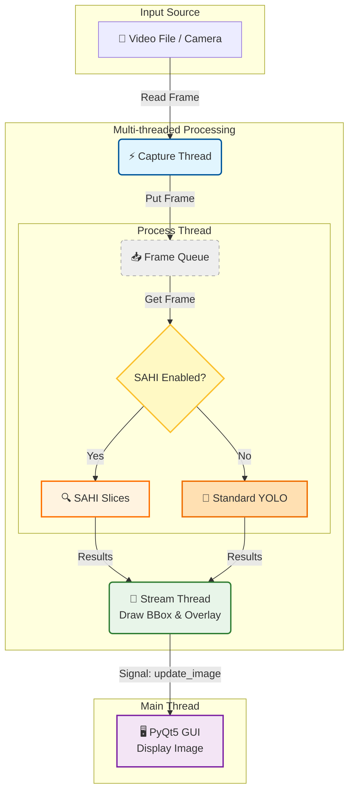

# YOLOv8 Multi-thread Detection

> **Hệ thống nhận diện đối tượng thời gian thực sử dụng YOLOv8 và PyQt5 với kiến trúc đa luồng hiệu năng cao.**

[](LICENSE)
[](https://www.python.org/)
[](https://github.com/ultralytics/ultralytics)

---

## 📚 Mục Lục

- [Giới Thiệu](#giới-thiệu)
- [Tính Năng](#tính-năng)
- [Yêu Cầu Hệ Thống](#yêu-cầu-hệ-thống)
- [Cài Đặt](#cài-đặt)
- [Sử Dụng](#sử-dụng)
- [Cấu Trúc Dự Án](#cấu-trúc-dự-án)
- [Configuration](#configuration)
- [License](#license)
- [Liên Hệ](#liên-hệ)

---

## 🎯 Giới Thiệu

### Vấn Đề
Trong các ứng dụng Computer Vision thời gian thực, việc chạy model AI nặng (như YOLO) trên cùng một luồng với giao diện (UI) và đọc video thường dẫn đến:
- ❌ **Lag giao diện**: UI bị treo khi model đang xử lý.
- ❌ **FPS thấp**: Tốc độ xử lý bị giới hạn bởi tác vụ chậm nhất.
- ❌ **Trải nghiệm kém**: Video không mượt mà, phản hồi chậm.

### Giải Pháp
Dự án này áp dụng kiến trúc **Multi-threading** (Đa luồng) để giải quyết triệt để các vấn đề trên:
- ✅ **Tách biệt tác vụ**: Chia nhỏ thành 3 luồng độc lập: Capture (Đọc ảnh), Process (Xử lý AI), và Stream (Hiển thị).
- ✅ **Tối ưu hiệu năng**: Tận dụng tối đa tài nguyên phần cứng (CPU/GPU).
- ✅ **Mượt mà**: Giao diện PyQt5 luôn phản hồi ngay lập tức, không bị block bởi AI.

### Công Nghệ
**YOLOv8 Multi-thread Detection** được xây dựng với:
- **Python 3.10+**: Ngôn ngữ lập trình chính.
- **YOLOv8 (Ultralytics)**: State-of-the-art Object Detection model.
- **PyQt5**: Framework giao diện mạnh mẽ và linh hoạt.
- **OpenCV**: Xử lý ảnh và video.
- **PyTorch**: Deep Learning framework hỗ trợ CUDA.
- **SAHI**: Slicing Aided Hyper Inference cho nhận diện đối tượng nhỏ.

---

## ✨ Tính Năng

### Core Features
- 🎯 **Real-time Detection**: Nhận diện người (Person detection) với độ chính xác cao sử dụng YOLOv8.
- 🚀 **Multi-threaded Architecture**:
  - **Capture Thread**: Đọc frame từ video/camera tốc độ cao.
  - **Process Thread**: Chạy AI inference độc lập.
  - **Stream Thread**: Hiển thị kết quả lên UI mượt mà.
- 📊 **FPS Monitoring**: Theo dõi tốc độ xử lý thực tế ngay trên giao diện.
- 🔍 **SAHI Integration**: Hỗ trợ Slicing Aided Hyper Inference giúp cải thiện đáng kể khả năng nhận diện đối tượng nhỏ trong ảnh độ phân giải cao.

### Advanced Features
- ⚙️ **Configurable**: Dễ dàng tùy chỉnh tham số qua file YAML (model path, video source, threshold, colors...).
- 🔧 **Custom Model Support**: Hỗ trợ sử dụng custom trained YOLOv8 models với input size tùy chỉnh (640, 896, 1024...).
- 🖥️ **GPU Acceleration**: Hỗ trợ chạy trên NVIDIA GPU (CUDA) để đạt hiệu năng tối đa.
- 🔄 **Queue Management**: Cơ chế hàng đợi (Queue) thông minh giúp đồng bộ hóa dữ liệu giữa các luồng mà không gây tắc nghẽn.
- 📐 **Polygon Zone Detection**: Tính năng vẽ vùng quan tâm (ROI) đa giác. Chỉ nhận diện đối tượng nằm trong vùng này.
- 🎯 **Flexible Input Size**: Điều chỉnh input size của model (640, 896, 1024...) để cân bằng giữa độ chính xác và tốc độ.
- 🧩 **Sliced Inference Control**: Tùy chỉnh số lượng slice (n_slices) và độ chồng lấn (overlap) để tối ưu hóa hiệu năng SAHI.
- 🔀 **NMS/NMM Support**: Hỗ trợ cả Non-Maximum Suppression (loại bỏ box) và Non-Maximum Merging (gộp box) với config toggle.
- 📏 **IOS Metric**: Sử dụng Intersection Over Smallest thay vì IoU để xử lý tốt hơn box bị cắt ở biên slice.

---

## 🏗️ Kiến Trúc Hệ Thống

Biểu đồ dưới đây mô tả luồng dữ liệu (Data Flow) giữa các thread trong ứng dụng:



---

## 💻 Yêu Cầu Hệ Thống

### Phần Cứng
- **CPU**: Intel Core i5 hoặc tương đương.
- **RAM**: Tối thiểu 8GB.
- **GPU**: Khuyến nghị NVIDIA GPU với CUDA support (để đạt FPS cao).

### Phần Mềm
- **OS**: Windows 10/11, Linux (Ubuntu 20.04+), macOS.
- **Python**: 3.10 trở lên.
- **CUDA**: 11.8+ (nếu sử dụng GPU).

### Dependencies Chính
```
PyQt5>=5.15.0
ultralytics>=8.0.0
opencv-python>=4.8.0
PyYAML>=6.0
torch>=2.0.0
numpy>=1.24.0
sahi>=0.11.0 # (Sử dụng phiên bản tương thích với torch)
pybboxes>=0.1.0 

```

---

## 🚀 Cài Đặt

### Bước 1: Clone Repository

```bash
git clone https://github.com/ntd237/detect_person_26022025.git
cd detect_person_26022025
```

### Bước 2: Tạo Virtual Environment

```bash
# Windows
python -m venv venv
venv\Scripts\activate

# macOS/Linux
python3 -m venv venv
source venv/bin/activate
```

### Bước 3: Install Dependencies

```bash
pip install -r requirements.txt
```

### Bước 4: Chuẩn bị Model và Video
- **Model**: Có thể sử dụng pretrained YOLOv8 models (yolov8n/s/m/l/x.pt) hoặc custom trained model:
  - Ultralytics sẽ tự tải pretrained models nếu chưa có
  - Đối với custom model, đặt file `.pt` vào `resources/models/` và cập nhật `model.path` trong config
  - Lưu ý điều chỉnh `model.input_size` phù hợp với model đã train
- **Video**: Đặt video test vào `resources/videos/` hoặc cập nhật `video.path` trong config (hỗ trợ video file, webcam, RTSP stream).

---

## 📖 Sử Dụng

### Chạy Ứng Dụng

```bash
python main.py
```

### Cấu Hình Nhanh
Mở file `resources/configs/config.yaml` để chỉnh sửa:
- Thay đổi `video.path` để đổi nguồn video (file path, `0` cho webcam, hoặc RTSP URL).
- Thay đổi `model.path` để sử dụng model khác (pretrained hoặc custom).
- Điều chỉnh `model.input_size` phù hợp với model (640 cho pretrained, 896/1024 cho custom).
- Thay đổi `model.device` thành `cpu` nếu máy không có GPU rời.
- Điều chỉnh `model.confidence_threshold` để cân bằng precision/recall.
- Đặt `polygon.enabled: true` để bật chế độ vẽ vùng giám sát.
- Đặt `sahi.enabled: true` để bật chế độ nhận diện đối tượng nhỏ (SAHI).

### Cấu Hình SAHI
Tùy chỉnh các tham số SAHI trong `config.yaml`:

```yaml
sahi:
  enabled: true            # Bật/tắt SAHI
  n_slices: 4              # Số slice chia ảnh theo chiều dài hơn
  overlap: 0.2             # Tỷ lệ chồng lấn giữa các slice (20%)
  iou_threshold: 0.45      # Ngưỡng để merge/loại bỏ box chồng lấn
  use_ios: true            # Sử dụng IOS metric (tốt hơn IoU cho box bị cắt ở biên)
  postprocess_type: nmm    # "nms" (loại bỏ box) hoặc "nmm" (merge box)
```

#### NMS vs NMM

| Đặc điểm | NMS (Non-Maximum Suppression) | NMM (Non-Maximum Merging) |
|----------|-------------------------------|---------------------------|
| **Hành vi** | Loại bỏ box overlap, giữ box confidence cao nhất | Merge các box chồng lấn thành 1 box lớn hơn |
| **Kết quả** | Số box giảm, kích thước giữ nguyên | Box lớn hơn bao trọn các box được merge |
| **Use case** | Object không bị cắt ở biên slice | Object bị cắt ở biên slice (SAHI default) |
| **Confidence** | Giữ nguyên của box tốt nhất | Trung bình các box được merge |

#### IOS vs IoU

| Metric | Mô tả | Use case |
|--------|-------|----------|
| **IoU** | Intersection / Union | Object có kích thước tương đương |
| **IOS** | Intersection / Smallest Area | Box bị cắt nhỏ hơn (SAHI default) |

> 💡 **Khuyến nghị**: Sử dụng `postprocess_type: nmm` và `use_ios: true` khi dùng SAHI để đạt kết quả tốt nhất với object bị cắt ở biên slice.

### Tính Năng Vẽ Polygon
Khi `polygon.enabled: true` được thiết lập trong config:
1. Khi khởi động, cửa sổ **Vẽ Polygon** sẽ hiện lên với frame đầu tiên của video.
2. **Thao tác**:
   - **Click Chuột Trái**: Thêm điểm vào đa giác.
   - **Click Chuột Phải** hoặc **Enter**: Hoàn thành và bắt đầu nhận diện.
   - **Phím C**: Xóa toàn bộ điểm để vẽ lại.
   - **Phím Esc**: Hủy bỏ và thoát ứng dụng.
3. Ứng dụng sẽ chỉ hiển thị và nhận diện người có tâm nằm trong vùng đa giác đã vẽ.

---

## 📁 Cấu Trúc Dự Án

```
detect_person_26022025/
├── main.py                   # Entry point của ứng dụng
├── requirements.txt          # Các thư viện cần thiết
├── src/                      # Source code chính
│   ├── __init__.py
│   ├── controller.py         # Quản lý và kết nối các luồng
│   ├── gui.py                # Giao diện người dùng (PyQt5)
│   ├── capture_thread.py     # Luồng đọc video
│   ├── process_thread.py     # Luồng xử lý AI (YOLOv8)
│   ├── stream_thread.py      # Luồng hiển thị hình ảnh
│   ├── polygon_drawer.py     # Giao diện vẽ polygon
│   ├── sahi_thread.py        # [NEW] Module xử lý SAHI (Sliced Inference)
│   └── utils.py              # Các hàm tiện ích (load config, draw...)
└── resources/                # Tài nguyên dự án
    ├── configs/
    │   └── config.yaml       # File cấu hình chính
    ├── models/
    │   └── yolov8m.pt        # Model weights
    └── videos/
        └── test.mp4          # Video test
```

---

## 📞 Liên Hệ

- **Name**: ntd237
- **Email**: ntd237.work@gmail.com
- **GitHub**: [@ntd237](https://github.com/ntd237)

---

**Made with ❤️ by ntd237**